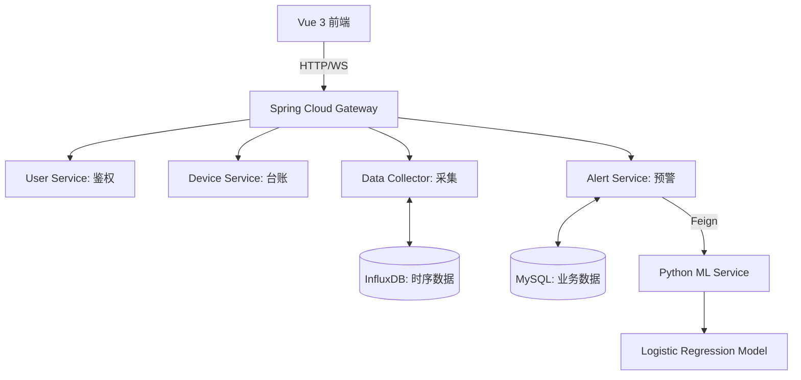

# 🛠️ 工业设备故障预警系统 (Industrial Equipment Fault Warning System)

> **河南科技大学 2026 届毕业设计** | 信息工程学院 | 陈阳
> 指导教师：王红艺

---

## 📖 项目简介

本项目是一款面向工业 4.0 场景的 **智能化故障预测与维护系统**。通过对工业设备（如电机、泵组、数控机床等）的温度、振动、压力等传感器数据进行实时采集，利用 **Logistic 回归机器学习算法** 实现故障概率的毫秒级预测，并结合 **WebSocket** 实现预警消息的主动推送。系统有效解决了工业现场「事后维修成本高」和「计划维护过度」的痛点，助力企业实现**预测性维护 (Predictive Maintenance)**。

## 🌟 核心功能

*   **📈 实时监测**：集成 ECharts 实现传感器数据（温度、振动、压力）的秒级动态曲线展示。
*   **🧠 智能预测**：基于 Python Flask 的 ML 服务，利用逻辑回归模型对设备健康状况进行实时打分。
*   **🔔 多级预警**：当故障概率超过阈值（如 0.7）时，系统自动触发告警并记录，通过 WebSocket 实时推送到前端页面。
*   **📂 维修闭环**：提供完整的设备台账管理及维修记录跟踪，实现从预警到响应的闭环管理。
*   **📊 趋势分析**：后端生成基于 Matplotlib 的多维数据趋势图，辅助专家进行深度诊断。

## 🏗️ 系统架构

## 🛠️ 技术栈

| 模块 | 技术实现 |
| :--- | :--- |
| **前端** | Vue 3, Element Plus, ECharts, Vite, Pinia |
| **网关** | Spring Cloud Gateway, JWT (JSON Web Token) |
| **后端微服务** | Spring Boot 3.2, Spring Cloud 2023, OpenFeign, Resilience4j |
| **机器学习** | Python 3.11, Flask, Scikit-learn, Matplotlib, Joblib |
| **数据库** | MySQL 8.0 (业务), InfluxDB 2.7 (时序) |
| **基础设施** | Eureka (注册中心), WebSocket (实时推送) |

## 🚀 快速启动

### 1. 环境准备
*   MySQL 8.0+: 执行 `sql/` 目录下所有脚本。
*   InfluxDB 2.7+: 创建 `sensor_data` 存储桶 (Bucket)，组织名为 `cy`。
*   Python 3.11+: 进入 `ml-service` 执行 `pip install -r requirements.txt`。

### 2. 启动顺序 (严格执行)
1.  **eureka-server**: 注册中心 (8761)
2.  **ml-service**: 启动 Python Flask 服务 (5000)
3.  **gateway-service**: 启动网关 (8080)
4.  **user-service / device-service / data-collector-service / alert-service**: 启动各业务微服务
5.  **frontend**: 执行 `npm install` 然后 `npm run dev` (3000)

## 📝 开发者说明

*   **API 文档**: 访问 `http://localhost:808x/swagger-ui.html` 查看各微服务接口文档。
*   **WebSocket**: 前端通过 `ws://localhost:8084/ws/alert` 建立原生连接。
*   **数据库 Token**: 请在 `application.yml` 中根据实际 InfluxDB 配置更新 Token。

## 📄 许可证

本项目仅供学术交流与毕业设计参考使用。